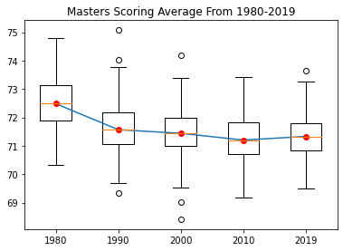
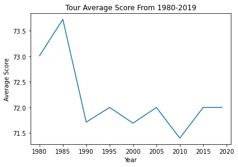

# Personal-Data-set

## Big Question
How do the scoring averages of golfers from decades past compare against the golfers of today?

## Motivation
I chose this topic becuase my family loves to play golf, I played golf competitively all through high school and I still play recreationally. Every August a large golf tournament called the Boeing Classic comes to Snoqualmie where lots of older but still legendary golfers will play, and it made me think how their scoring average in their prime compares to the golfers who are currently in the PGA like Dustin Johnson or Tiger Woods.

## Data Set
I pulled this data from the PGA Tour website which listed the scoring averages of players dating back to 1980. Using the Masters as a control since it takes place at the exact same golf course so I had some resemblence of a control. In order to keep load light I picked the beginning of each decade (like 1980, 1990, 2000, 2010). As far as cleaning goes I didn't have to clean that much because it was already done ahead of time by the PGA.

## Visualizations

Although the line through the median of each year shows a pretty shallow curve, it still shows a correlation that the median scoring average has decreased over the past 40 years

This graph compares the Tour's score as a whole and shows that again, despite there being a mostly small difference between the individual values, there is still somewhat of a downward trend, meaning that as a whole, a majority of the PGA Tour has shaved off at least 1-2 strokes from their game.

## Conclusions
The increase in player performance could be due to a number of factors
* Improved technologies like improved ball design which allow the ball to fly further due to improved aerodynamics, club manufacturing and composition which can eliminate spin
* The professional scene in golf has become a lot more lucrative. Decades ago professional golfers earned about as much as a dealership owner, but nowadays golf is one of the most paid sports out there, with winners earning millions of dollars per game
* Increased opportunities to play. Playing golf has become easier than it used to be, I have around 5 municipal golf courses within a 20-30 minute drive. As well as a junior golf program that allows kids to play for as little as 5 dollars, which allows them to develop a love for the game and want to keep on playing. 

## What I Could Improve on
When you look at the data, the amount of times a person appears at the Masters varies, I'm sure there is a way to compare each of the golfers on a level playing field but I did not know how to do that
